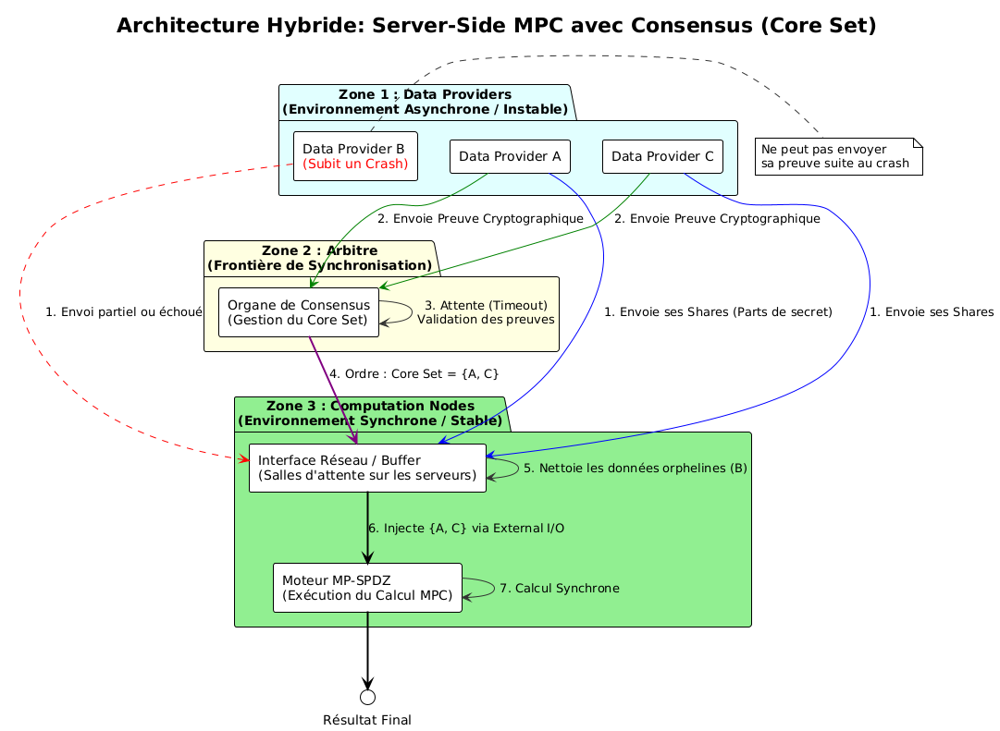

# MPC Asynchrone avec Core Set via Consensus Externe

Ce dépôt contient un prototype académique de calcul multipartite sécurisé (MPC)
intégrant MP-SPDZ sans modifier son code source.

Le but est de montrer un enchaînement simple et fonctionnel :
1. des fournisseurs envoient des valeurs,
2. un consensus centralisé décide le core set (participants valides),
3. MP-SPDZ exécute la somme uniquement sur ce core set.

## Objectifs du prototype

- Simuler des crashes (participant absent).
- Valider l'intégrité et l'authenticité des contributions côté consensus.
- Produire une démo minimale de calcul MPC (addition).
- Illustrer les difficultés d’intégration MP-SPDZ (offline/online, fichiers, lancement).

## Architecture

## Correspondance avec l'architecture (Zone 1 / 2 / 3)

Cette section fait le lien direct avec le schéma "Architecture Hybride: Server-Side MPC avec Consensus (Core Set)".

### Zone 1 : Data Providers (asynchrone / instable)

- Composant : `node/src/data_provider.cpp`
- Exécutable : `./build/node/data_provider <id> <value>`
- Rôle :
  - envoi d'une contribution individuelle,
  - crash simulé si le provider n'est pas lancé,
  - écrit une contribution signée vérifiable par le consensus.
- Trace concrète : fichiers `inputs/provider_<id>.txt`.

### Zone 2 : Arbitre / Consensus (frontière de synchronisation)

- Composant : `consensus/src/consensus.cpp`
- Exécutable : `./build/consensus/consensus [min_inputs] [--acks-dir ... --k ... --session-id ... --round-id ... --timeout-seconds ...]`
- Rôle :
  - lit les entrées providers et valide leurs preuves cryptographiques,
  - en mode ACK, vérifie signatures/hashes/fraîcheur/anti-replay,
  - exclut les entrées absentes ou invalides,
  - décide le `core set`.
- Trace concrète : fichier `core_set.txt` (un identifiant valide par ligne).

### Zone 3 : Computation Nodes (synchrone / stable)

- Composants :
  - `spdz_bridge/src/spdz_bridge.cpp`
  - `programs/sum.mpc`
  - runtime MP-SPDZ dans `third_party/MP-SPDZ`
- Rôle :
  - conversion du core set en parties MP-SPDZ actives,
  - préparation des fichiers `Player-Data/Input-P*-0`,
  - compilation/exécution du programme MPC,
  - calcul synchrone sur les seules parties retenues.
- Trace concrète :
  - logs d'exécution,
  - sortie `SUM=<valeur>`.

### `node/` (data providers)
- Exécutable `data_provider`.
- Écrit un fichier `inputs/provider_<id>.txt`.
- Format signé attendu :
  - `id=<id>`
  - `masked_value=<x_i - s_i>`
  - `nonce=<hex>`
  - `proof=<blake2b_hex>`
- La preuve est calculée avec une clé partagée (`MPC_PROVIDER_SECRET`).

### `consensus/`
- Exécutable `consensus`.
- Lit `inputs/`, valide les fichiers.
- Vérifie la preuve cryptographique (`proof`) pour chaque entrée.
- En mode ACK: applique le seuil `k` sur des ACK signés de CN distincts.
- Écrit `core_set.txt` (un id par ligne).

### `spdz_bridge/`
- Exécutable `spdz_bridge`.
- Lit `core_set.txt`.
- Prépare `Player-Data/Public-Masked-Values` et `Player-Data/Input-P*-0`.
- Compile `programs/sum.mpc`.
- Lance le backend MP-SPDZ demandé (`semi2k`, `semi`, `shamir`, `replicated-ring`, `replicated-field`, `player-online`).
- En cas d’échec runtime/setup, affiche une somme de fallback calculée localement.

### `programs/sum.mpc`
- Lit `N` entrées secrètes (`N = taille du core set`).
- Calcule la somme.
- Révèle `SUM=<résultat>`.


## Arborescence

```text
mp-spdz-async-orchestration/ (racine du projet)
├── core_set.txt (sortie du consensus, généré à l'exécution)
├── common/ (code C++ partagé)
│   ├── CMakeLists.txt (build du module common)
│   ├── include/common/ (headers partagés: types/messages/api)
│   └── src/ (implémentations utilitaires/stubs)
├── node/ (Zone 1: data providers)
│   ├── CMakeLists.txt (build de data_provider)
│   ├── include/node/ (headers du module)
│   └── src/
│       └── data_provider.cpp (écrit inputs/provider_<id>.txt)
├── consensus/ (Zone 2: arbitre / décision du core set)
│   ├── CMakeLists.txt (build de consensus)
│   ├── include/consensus/ (headers du module)
│   └── src/
│       └── consensus.cpp (timeout + validation + génération core_set.txt)
├── spdz_bridge/ (Zone 3: interface vers MP-SPDZ)
│   ├── CMakeLists.txt (build de spdz_bridge)
│   ├── include/spdz_bridge/ (headers du module)
│   └── src/
│       └── spdz_bridge.cpp (prépare Input-P* + compile/run MP-SPDZ)
├── programs/ (programmes MPC)
│   ├── sum.mpc (programme principal: somme des entrées)
│   └── issue_secrets.mpc (émission des secrets providers)
├── docs/ (docs architecture/protocole/threat model)
├── configs/ (fichiers de configuration de démo)
├── scripts/ (scripts utilitaires du projet)
├── others/ (assets annexes)
│   └── architecture.png (image utilisée dans le README)
├── third_party/ (dépendances externes)
│   └── MP-SPDZ/ (sous-module MP-SPDZ non modifié)
├── build/ (artefacts de compilation CMake, généré)
│   ├── node/data_provider (binaire provider)
│   ├── consensus/consensus (binaire consensus)
│   └── spdz_bridge/spdz_bridge (binaire bridge)
├── inputs/ (entrées providers, généré pendant la démo)
│   └── provider_<id>.txt (valeur d'un provider)
└── logs/ (logs d'exécution bridge, généré)
    └── player_<party>.log (sortie de chaque partie MP-SPDZ)
```

## Prérequis

- macOS/Linux avec CMake et compilateur C++20.
- `libsodium` (utilisé pour la preuve cryptographique BLAKE2b).
- MP-SPDZ présent dans `third_party/MP-SPDZ`.
- Pour l’exécution complète MP-SPDZ (offline+online) :
  - `Player-Online.x`
  - `Fake-Offline.x`
- `grep` suffit pour les vérifications (pas besoin de `rg`).

## Compilation du prototype C++

Depuis la racine du projet :

```bash
cmake -S . -B build
cmake --build build -j4
```

## Windows + WSL (recommandé)

Si tu développes sur Windows, utilise WSL pour toute la chaîne CMake/MP-SPDZ.

Depuis PowerShell :

```powershell
wsl -e bash -lc "cd /mnt/d/cours/M2FSI/PFE/MPC/mp-spdz-async-orchestration && ./scripts/run_bridge_wsl.sh"
```

Ce script fait automatiquement :
- `cmake ..`
- `cmake --build . -j`
- `./spdz_bridge/spdz_bridge`

Tu peux aussi passer les arguments du bridge :

```powershell
wsl -e bash -lc "cd /mnt/d/cours/M2FSI/PFE/MPC/mp-spdz-async-orchestration && ./scripts/run_bridge_wsl.sh --backend semi2k --computation-nodes 3"
```

## Démo rapide (crash + somme)

Depuis la racine du projet :

```bash
# Optionnel: fixer la même clé partagée côté providers et consensus
# (sinon la valeur par défaut "mpc-demo-secret" est utilisée partout)
export MPC_PROVIDER_SECRET="mpc-demo-secret"

rm -rf inputs core_set.txt logs

# providers valides
./build/node/data_provider 1 7
./build/node/data_provider 2 15

# ne pas lancer provider 3 -> crash simulé

# consensus (attente 3 secondes)
./build/consensus/consensus 3

# bridge (préparation inputs MP-SPDZ + compilation programme)
./build/spdz_bridge/spdz_bridge
```

Résultat attendu côté consensus :
- `core_set.txt` contient les providers valides lancés avant consensus (ex. `1` et `2` si `3` n'est pas lancé).

## Exécution MP-SPDZ complète (offline + online)

Depuis `third_party/MP-SPDZ` :

```bash
# une seule fois si nécessaire
echo 'MY_CFLAGS += -DINSECURE' >> CONFIG.mine
make clean
make -j4 Fake-Offline.x Player-Online.x

# génération des certificats + preprocessing
rm -rf Player-Data/2-p-128
./Scripts/setup-online.sh 2 128 0 10000

# vérification clé
ls -l Player-Data/2-p-128/Params-Data

# exécution online du programme compilé (sum-2)
./Scripts/run-online.sh sum-2 -N 2
```

Résultat attendu :
- affichage terminal : `SUM=22`

Vérification dans les logs MP-SPDZ :

```bash
grep -R "SUM=" logs
```

## Dépannage

- Erreur `no modulus in Player-Data//2-p-128/Params-Data` :
  - `Fake-Offline.x` n’a pas généré correctement le preprocessing.
  - Refaire `make ... Fake-Offline.x` puis `./Scripts/setup-online.sh ...`.

- Erreur `You are trying to use insecure benchmarking functionality` :
  - ajouter `MY_CFLAGS += -DINSECURE` dans `CONFIG.mine`,
  - puis `make clean` et recompiler.

- Erreur `zsh: no matches found` sur un glob :
  - utiliser `ls logs` puis `grep -R "SUM=" logs`.

## Orchestration asynchrone externe (Phase 1)

Pour avancer vers un modèle "MP-SPDZ compute-only", le dépôt contient
un orchestrateur externe qui pilote un round complet et produit des
artefacts de décision.

Commande (WSL/Linux) :

```bash
./scripts/run_async_round_wsl.sh \
  --clean \
  --session-id demo-session \
  --round-id 0 \
  --providers 1:10,2:20,3:30,4:40,5:50 \
  --k-acks 2 \
  --ack-nodes 3 \
  --ack-timeout-seconds 2 \
  --backend semi2k \
  --computation-nodes 3
```

Artefacts générés :
- `artifacts/run_meta.json`
- `artifacts/core_set.json`
- `artifacts/justification.json`
- `artifacts/acks/ack_p*_cn*.json`
- `artifacts/cn_keys/cn_*.pub.hex` et `cn_*.sec.hex` (signatures ACK Ed25519)

Schémas JSON de référence :
- `schemas/ack.schema.json`
- `schemas/core_set.schema.json`
- `schemas/justification.schema.json`

Scénarios ACK négatifs (insufficient/replay/hash/stale) :

```bash
./scripts/full_system_validation_wsl.sh
```

Rapport agrégé généré :
- `backend_test_summary.txt`

## Limites

- Consensus centralisé simulé (pas de vrai consensus byzantin).
- Communication simplifiée par fichiers.
- Objectif pédagogique/prototype, pas production.
