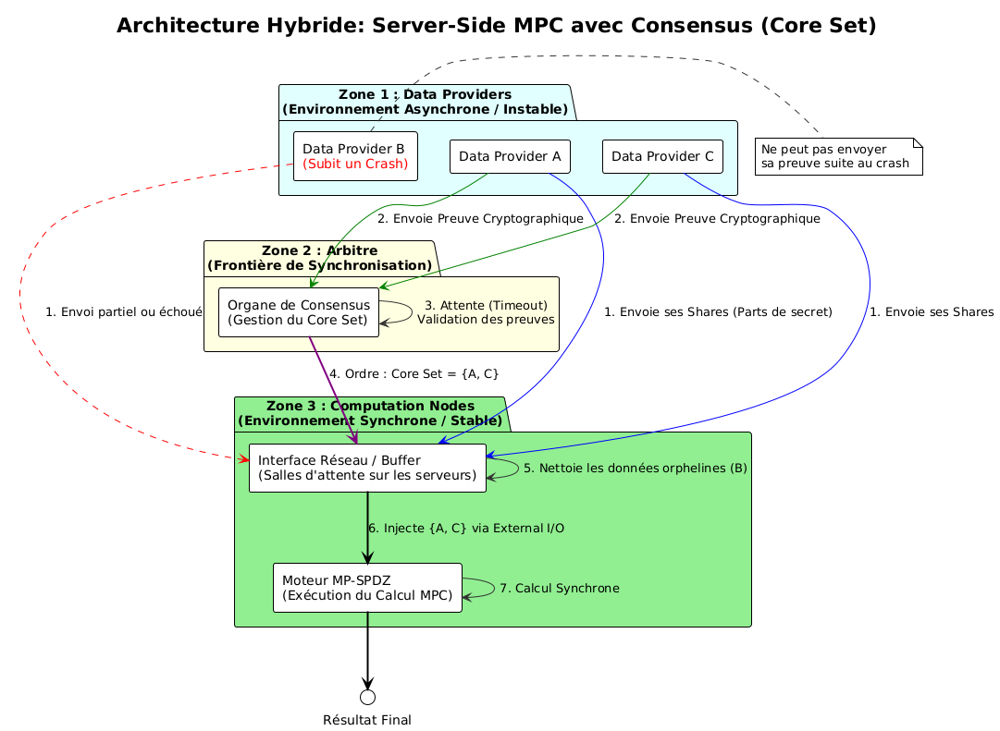

# MPC asynchrone avec core set via consensus externe

Prototype académique de calcul multipartite sécurisé (MPC) branché sur **MP-SPDZ** sans modifier les sources de MP-SPDZ.

Enchaînement :

1. Le provider produit `inputs/provider_<id>.txt`, `inputs/provider_<id>_manifest.json`, `inputs/provider_<id>_type_proof.json` et `provider_secrets/provider_<id>_share_<p>.secret`.
2. Chaque `share_verifier` (un processus par `party_index`) vérifie sa share locale et produit un ACK signé.
3. Le **consensus** vérifie provider evidence + `type_proof`, puis (en mode ACK) vérifie les ACKs et impose une couverture complète des `party_index` requis ; il écrit `core_set.txt`.
4. Le **bridge** lit `core_set.txt`, prépare `Player-Data` pour **semi2k**, compile le **programme `.mpc` choisi** et lance **`semi2k-party.x`** ; il n’a aucun rôle d’admission.

## Objectifs du prototype

- Simuler des absences (provider non soumis).
- Valider intégrité et authenticité côté consensus : preuve BLAKE2b keyed + cohérence manifest + `type_proof` vérifié directement par `consensus` (pas de `type_ack`).
- Valider (en mode ACK) la cohérence de partage via ACK signés par `share_verifier` et une couverture complète des `party_index` requis.
- Démo MPC sur le core set : **n’importe quel programme semi2k** fourni dans `programs/` (somme, moyenne, etc.).
- Montrer l’intégration MP-SPDZ (fichiers `Player-Data`, `compile.py`, exécution en ligne semi2k).

## Architecture



### Répertoire de travail (important)

Les binaires (`data_provider`, `consensus`, `spdz_bridge`) résolvent **`inputs/`**, **`core_set.txt`**, **`third_party/MP-SPDZ/`**, **`logs/`**, **`provider_secrets/`** par rapport au **répertoire courant** (`fs::current_path()` / `getcwd`).  
Il faut donc **toujours les lancer depuis la racine du dépôt**, pas depuis `build/`.

### Zone 1 — Data providers (asynchrone)

| Élément | Détail |
|--------|--------|
| Code | `node/src/data_provider.cpp` |
| Binaire | `./build/node/data_provider <id> <valeur> [--computation-nodes N]` |
| Défaut | `--computation-nodes` vaut **3** si omis |
| Sortie | `inputs/provider_<id>.txt` (id, valeur masquée, nonce, preuve BLAKE2b), `inputs/provider_<id>_manifest.json`, `inputs/provider_<id>_type_proof.json` |
| Secrets | Parts additives de \(s_i\) dans `provider_secrets/` : `provider_<id>_share_<p>.secret` |

Variable optionnelle : `MPC_PROVIDER_SECRET` (sinon `mpc-demo-secret`, secret de démo partagé avec le consensus).

### Zone 2 — Consensus

| Élément | Détail |
|--------|--------|
| Code | `consensus/src/consensus.cpp` (admission + vérif `type_proof`), `consensus/src/type_proof.cpp` (backends), `consensus/src/share_verifier.cpp` (production d'ACK) |
| Binaire | `./build/consensus/consensus [min_inputs] [--acks-dir … --k … …]` |
| Sortie | `core_set.txt` (un identifiant de provider par ligne) |

Sans `--acks-dir` : consensus valide preuve BLAKE2b + syntaxe du wire + `type_proof` et sélectionne un `core_set.txt` dès qu'il atteint au moins `min_inputs` provider admissibles. Avec `--acks-dir` : en plus, consensus vérifie les ACKs signés et impose une couverture complète des `party_index` `0..k-1` avant d'admettre le provider (`--timeout-seconds` + anti-replay).

### Zone 3 — Bridge MP-SPDZ (semi2k uniquement)

| Élément | Détail |
|--------|--------|
| Code | `spdz_bridge/src/spdz_bridge.cpp`, `spdz_bridge/src/semi2k_prep.cpp` |
| Binaire | `./build/spdz_bridge/spdz_bridge [--computation-nodes N] [chemin/vers/programme.mpc]` |
| Programme MPC | **Chemin optionnel** vers un fichier `.mpc` (souvent sous `programs/`). Si omis : défaut **`programs/sum.mpc`**. Tu peux enchaîner `avg.mpc`, `triple_sum.mpc`, `parity_sum.mpc`, ou tout autre programme semi2k compatible avec les mêmes entrées (voir chaque fichier dans `programs/`). |
| Backend | **Uniquement semi2k** (\(\mathbb{Z}/2^{64}\mathbb{Z}\)) — pas d’option `--backend` |

Le bridge :

- lit `core_set.txt` et, pour chaque provider, ne consomme que `inputs/provider_<id>.txt` (champ `masked_value`) ;
- charge `provider_secrets/provider_<id>_share_<p>.secret` et écrit sous `third_party/MP-SPDZ/Player-Data/` : `Public-Masked-Values` et `Input-P*-0` ;
- exécute `python3 compile.py -R 64 …` dans `third_party/MP-SPDZ` en pointant vers le **fichier `.mpc` demandé** (n’importe quel programme du dossier `programs/` ou chemin absolu) ;
- lance **`third_party/MP-SPDZ/semi2k-party.x`** pour chaque partie (ports `-pn`, hôte `localhost` pour \(p>0\)).

Résultat attendu dans `logs/player_0.log` : lignes `SUM=…` ou `RESULT=…` ; le bridge affiche alors `MP-SPDZ result: …`.

Si `semi2k-party.x` est absent ou si la compilation / MPC échoue, la sortie peut **ne pas** contenir `MP-SPDZ result:` (pas de fallback plaintext/sum ; voir dépannage).

### Module `common/`

Bibliothèque statique partagée : types réseau, sérialisation, utilitaires crypto (`common/src/*.cpp`, headers sous `common/include/common/`). Liée par `consensus`, `node` et le bridge.

### Programmes MPC (`programs/`)

| Fichier | Rôle |
|---------|------|
| `sum.mpc` | Somme des entrées → `SUM=…` |
| `avg.mpc` | Moyenne → `RESULT=…` |
| `triple_sum.mpc` | Somme triple → `RESULT=…` |
| `parity_sum.mpc` | Parité de la somme → `RESULT=…` |

Le masquage et les parts ne passent pas par un `issue_secrets.mpc` : ils sont gérés en C++ (`data_provider`, `semi2k_prep`).

## Arborescence (principale)

```text
mp-spdz-async-orchestration/
├── CMakeLists.txt
├── LICENSE
├── demo_gui.py              # interface Tkinter optionnelle (lancer depuis la racine du dépôt)
├── common/                  # bibliothèque partagée
├── node/                    # data_provider
├── consensus/               # consensus + ack_crypto_tool
├── spdz_bridge/             # bridge semi2k
├── programs/                # .mpc (sum, avg, triple_sum, parity_sum)
├── scripts/                 # orchestration, validation complète
├── schemas/                 # schémas JSON (ACK, core set, justification)
├── docs/                    # architecture, protocole, notes
├── others/                  # assets (ex. architecture.png)
├── third_party/MP-SPDZ/     # sous-module Git — compiler semi2k-party.x
├── .gitmodules
├── build/                   # sortie CMake (généré ; souvent ignoré par git)
├── inputs/                  # généré à l’exécution
├── logs/                    # logs des parties semi2k
├── provider_secrets/        # parts par provider (généré)
├── core_set.txt             # sortie consensus (généré)
└── artifacts/               # JSON (mode ACK / orchestrateur)
```

## Prérequis

- **CMake** ≥ 3.20, compilateur **C++20**
- **pkg-config** et **libsodium**
- En-têtes **Boost.Multiprecision** (`boost/multiprecision/cpp_int.hpp`) — ex. paquet `libboost-dev` (Debian/Ubuntu)
- **Python 3** (pour `third_party/MP-SPDZ/compile.py`)
- **MP-SPDZ** dans `third_party/MP-SPDZ` : initialiser le sous-module puis compiler **`semi2k-party.x`**

Initialisation du sous-module :

```bash
git submodule update --init --recursive
```

La chaîne **Player-Online.x / Fake-Offline.x** du tutoriel amont MP-SPDZ **n’est pas** utilisée pour le flux semi2k de ce dépôt (préparation dans `semi2k_prep` + binaire en ligne).

## Compiler le projet C++

À la **racine** du dépôt :

```bash
cmake -S . -B build
cmake --build build -j4
```

Cibles : `data_provider`, `consensus`, `ack_crypto_tool`, `spdz_bridge`.

## Compiler MP-SPDZ (obligatoire pour le bridge)

```bash
cd third_party/MP-SPDZ
# Dépendances : voir README MP-SPDZ (make, g++, libsodium, etc.)
make -j4 semi2k-party.x
cd ../..
test -f third_party/MP-SPDZ/semi2k-party.x && echo OK
```

Sans ce fichier, le message `semi2k-party.x not found` apparaît et il n’y a pas de ligne `MP-SPDZ result:`.

## Windows + WSL

Préférer **WSL** pour bash, CMake et MP-SPDZ.

`scripts/run_bridge_wsl.sh` configure le build puis exécute **`spdz_bridge` avec la racine du dépôt comme répertoire courant** (indispensable pour trouver `third_party/` et `programs/`).

Exemple (adapter le chemin) :

```powershell
wsl -e bash -lc "cd /chemin/vers/mp-spdz-async-orchestration && ./scripts/run_bridge_wsl.sh --computation-nodes 2"
```

Pas d’option `--backend` : le bridge prend `--computation-nodes` et un **chemin optionnel vers un `.mpc`** (ex. `programs/avg.mpc`). Sans second argument, il utilise **`programs/sum.mpc`**.

### Interface graphique optionnelle

```bash
python3 demo_gui.py
```

À lancer **depuis la racine du dépôt** après compilation. `demo_gui.py` propose plusieurs **onglets** : flux manuel (zones 1→3), **orchestrateur ACK** (`async_orchestrator.py`), **scénarios de sécurité** (altération BLAKE2b, provider tardif, confidentialité du masquage, crash, matrice de programmes `.mpc`), et **intégration** (lancement de `scripts/full_system_validation_wsl.sh`). Les commandes utilisent `./build/...` avec `cwd` = racine du projet.

## Démo rapide (2 providers, 3ᵉ absent)

Le consensus doit avoir **`min_inputs` = 2** si seuls les providers 1 et 2 sont lancés. Utiliser **`--computation-nodes 2`** pour aligner le partage de secrets et le MPC sur deux parties.

```bash
export MPC_PROVIDER_SECRET="mpc-demo-secret"   # optionnel

rm -rf inputs logs artifacts core_set.txt provider_secrets
mkdir -p inputs logs artifacts provider_secrets

./build/node/data_provider 1 7 --computation-nodes 2
./build/node/data_provider 2 15 --computation-nodes 2

./build/consensus/consensus 2

./build/spdz_bridge/spdz_bridge --computation-nodes 2
# autre programme (ex. moyenne) :
# ./build/spdz_bridge/spdz_bridge --computation-nodes 2 programs/avg.mpc
```

Ne pas appeler `consensus 3` avec seulement deux fichiers provider valides : échec (« pas assez d’entrées ») et pas de `core_set.txt`.

## Orchestration asynchrone (`async_orchestrator.py`)

`scripts/run_async_round_wsl.sh` compile les binaires nécessaires puis appelle l’orchestrateur. **Il n’y a pas d’option `--backend`** (le champ `backend: semi2k` dans `artifacts/run_meta.json` est informatif). L’orchestrateur lance le bridge **sans** argument de programme : exécution du défaut **`programs/sum.mpc`**. Pour un autre `.mpc`, lancer `spdz_bridge` manuellement avec le chemin voulu après le round.

En mode ACK, l’orchestrateur génère les ACKs **uniquement** via `consensus/share_verifier` (un ACK moderne par `party_index`). `consensus` ne supporte plus d’ancien format d’ACK.

```bash
./scripts/run_async_round_wsl.sh \
  --clean \
  --session-id demo-session \
  --round-id 0 \
  --providers 1:10,2:20,3:30,4:40,5:50 \
  --k-acks 2 \
  --ack-nodes 3 \
  --ack-timeout-seconds 2 \
  --computation-nodes 3
```

Artefacts : `artifacts/run_meta.json`, `artifacts/core_set.json`, `artifacts/justification.json`, `artifacts/acks/`, `artifacts/cn_keys/`. Schémas : `schemas/*.schema.json`.

Astuce tests : `--skip-bridge` permet de s’arrêter après la décision du consensus (utile si `semi2k-party.x` n’est pas compilé).

## Tests d’intégration complets

```bash
bash scripts/full_system_validation_wsl.sh
```

Résumé : `backend_test_summary.txt`. Journaux détaillés : `.tmp_full_test_runs/`.  
Les étapes MPC nécessitent **`semi2k-party.x`** et Python opérationnel. Un échec du type « no result line in output » arrive souvent si le binaire MP-SPDZ manque **ou** si le bridge retourne 0 sans ligne `MP-SPDZ result:` (comportement actuel du script).

## Dépannage

- **`semi2k-party.x not found`** : compiler MP-SPDZ dans `third_party/MP-SPDZ` ; vérifier que le sous-module est bien présent (`git submodule update --init --recursive`).
- **Chemins incorrects (`third_party` introuvable)** : lancer les binaires depuis la **racine du dépôt**, pas depuis `build/`.
- **Pas de `MP-SPDZ result:`** : lire `logs/player_0.log` et la sortie du bridge (`MP-SPDZ compilation failed`, `Could not parse result`, etc.).
- **`compile.py` échoue** : dépendances Python / environnement MP-SPDZ.
- **Consensus sans `core_set.txt`** : moins de `min_inputs` entrées valides que demandé.
- **Erreur de compilation C++** `std::vector` / en-tête manquant sur une autre machine : inclure explicitement `<vector>` dans les fichiers qui utilisent `std::vector` (certains compilateurs n’incluent pas transitivement cet en-tête).
- Détails **MP-SPDZ amont** (modulus, `INSECURE`, etc.) : [README MP-SPDZ](https://github.com/data61/MP-SPDZ).

## Limites

- Consensus centralisé par fichiers (pas de consensus byzantin réaliste).
- Prototype pédagogique, pas destiné à la production.

## Limitations / Hardening futur

- Si `MPC_PROVIDER_SECRET` est absent : `data_provider` et `consensus` utilisent par défaut `mpc-demo-secret` (auth BLAKE2b keyed) ; à remplacer par un secret distinct, géré proprement, et idéalement rotaté.
- Prototype single-machine : l'admission (`consensus`) et l'exécution MP-SPDZ tournent localement (souvent via WSL) ; ce n'est pas un réseau distribué byzantin.
- `type_proof` backends : le backend sémantique actuel (`semantic-schema-v1`) est une preuve sémantique non-ZK (blob validé contre `schemas/type_registry.json`) et ne constitue pas une garantie cryptographique forte finale. Le backend `proof-real-v1` améliore la robustesse via engagements/OR-proof/équation sur engagements, mais reste un prototype (pas un SNARK complet). La garantie cryptographique forte finale nécessite l'intégration d'un système de preuve formellement ZK/SNARK, avec clés et garanties adaptées, sans dépendre des éléments non-ZK du backend sémantique.
